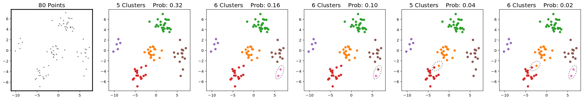

# Neural Clustering Process
Implementation of the Neural Clustering Process (NCP) algorithm.
Based on the papers:

- Pakman and Paninski, [Amortized Bayesian Inference for Clustering Models](https://arxiv.org/abs/1811.09747), BNP@NeurIPS 2018 Workshop
- Pakman, Wang, Mitelut, Lee and Paninski, [Neural Clustering Processes](https://arxiv.org/abs/1901.00409), ICML 2020

```bash
pip3 install -r requirements.txt
python3 main.py --model Gauss2D
python3 main.py --model MNIST
```

The code contains two implementations of the NCP algorithm, which differ in the way GPU parallelism is handled:
1. In ```ncp.py,``` used at train time, parallelization is over a minibatch of datasets, all with the same size and cluster structure.
2. In ```ncp_sampler.py,``` used at test time, only one dataset is used, and samples with different cluster structures are generated in parallel. The use of ```ncp_sampler.py``` is illustrated in ```plot_functions.py```. 

For an application of NCP to spike sorting, see [NCP-Sort](https://github.com/yueqiw/ncp-sort)


<p align="center"> 

</p>

<p align="center"> 
Given the observations in the leftmost panel, we show samples from the posterior of a Dirichlet Process Mixture Model of 2D Gaussians, 
indicating in each case the number of clusters and posterior probability. 
</p>
